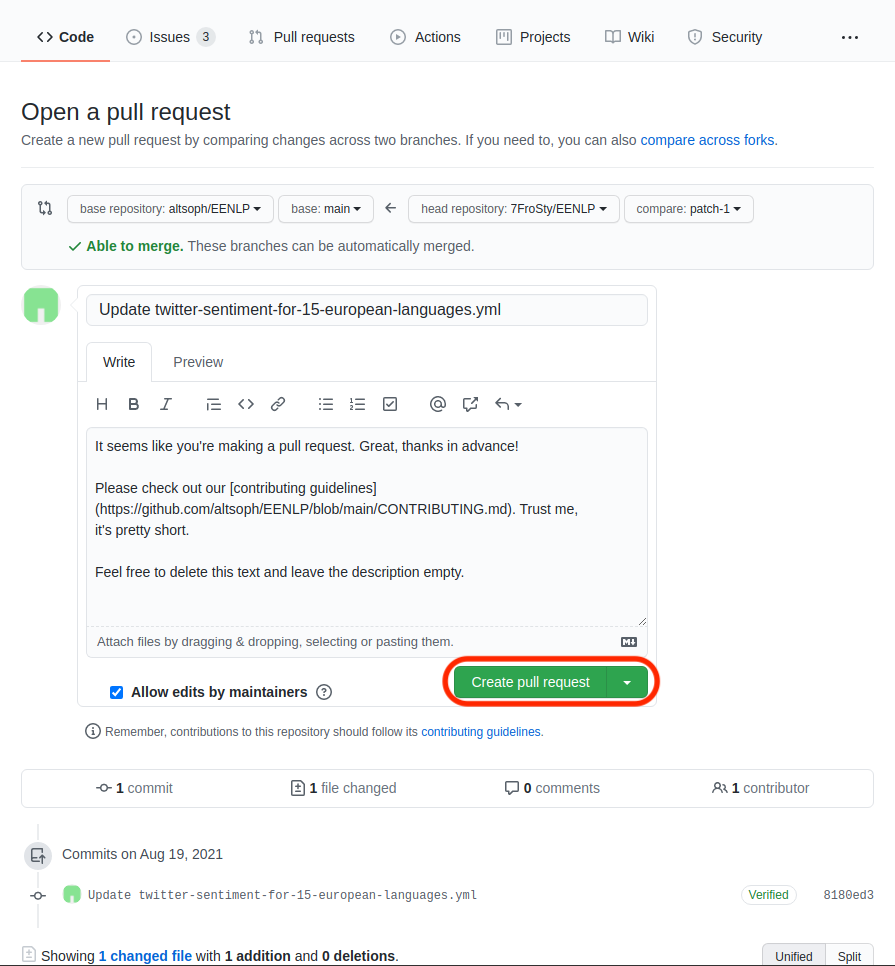

# Contributing guidelines

## Contributing to the resource lists

- tldr
    - Edit the yml files in `docs/data`.
    - There's json schema in the same folder, GitHub actions will update the pages.

Currently, we have these collections (edit these):

- [docs/data/datasets](docs/data/datasets)
- [docs/data/models](docs/data/models)

And these pages are generated automatically (do not edit these as they will automatically update):

- [docs/datasets.md](docs/datasets.md)
- [docs/models.md](docs/models.md)

There are 2 options to create a pull request, the first being easier.

### Contribute directly on GitHub

- You need to have a GitHub account and be logged in.
- Go to one of the aforementioned folders ([datasets](docs/data/datasets) or [models](docs/data/models)).
- Either click "Add file" in the top right, or open a file to edit and click the "pencil" icon on the top right. When
  adding a new file, try to search for it in the .md pages first to make sure you're not adding a duplicate.
  Alternatively, you can click on the "edit" links on the .md pages.
- 
- Click "Fork this repository".
- 
- Make edits. Copy an existing one as a reference when creating a new one. See these files for the possible fields and
  possible values for certain fields:
    - [_dataset.schema.json](docs/data/datasets/_dataset.schema.json)
    - [_model.schema.json](docs/data/models/_model.schema.json)
    - We allow some flexibility for certain values, e.g. if the category doesn't yet exist (these are the fields that
      can be both "enum" and "string" in the json schema).
- You can use this free online service to validate your changes against the schema:
    - [https://jsonschemalint.com/#!/version/draft-07/markup/yaml](https://jsonschemalint.com/#!/version/draft-07/markup/yaml)
    - Copy one of these schemas to the textarea on the left, and copy the content of the proposed file to the right.
        - [_dataset.schema.yml](docs/data/datasets/_dataset.schema.yml)
        - [_model.schema.yml](docs/data/models/_model.schema.yml)
    - 
    - If the message under the right panel says "Document validates against the schema" then you're good to go.
- Click "Propose changes" at the bottom of the page.
- 
- Click "Create pull request".
- 
- Clear the description field. If you have any additional notes for us, you can write them there, but if not, it's ok to
  leave empty.
- Click "Create pull request."
- 
- Some automated checks will run on your changes.
    - 
    - We need to manually approve running the checks, please wait.
    - 
    - If the checks fail, see the reason. Probably it will be schema validation, some missing required field, or such.
      We hope the error messages will be straightforward.
    - 
- If all is green, wait until we merge your pull request. Thank you.

### Checkout the project locally

You can also check out the project to your own machine, and do the pull request manually, if you already did such thing
and you generally know how to do that.

In this case, json-schema-based autocomplete for the yml files should work (I hope) in VSCode and PyCharm.
