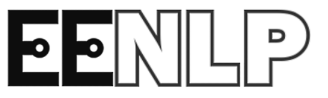

# EENLP

<p align="center">
    
</p>

## About

This repo contains a collection of NLP (natural language processing) machine learning datasets and models for Eastern
European languages<sup>[1](#footnote-1)</sup>. We plan to add more and more task-specific evaluations and handcrafted
datasets as the project progresses.  
It originally started as a project
at [EEML 2021](https://www.eeml.eu/previous-editions) ([Eastern European Machine Learning Summer School](https://www.eeml.eu)), (hence the scope), self-organized by a group of participants.  
We hope that arranging and publishing these resources could be helpful for the NLP community.

## Resources

### [See datasets](docs/datasets.md)

## <a title='Albanian' href='docs/datasets.md#-albanian'>:albania:</a> <a title='Armenian' href='docs/datasets.md#-armenian'>:armenia:</a> <a title='Belarusian' href='docs/datasets.md#-belarusian'>:belarus:</a> <a title='Bosnian' href='docs/datasets.md#-bosnian'>:bosnia_herzegovina:</a> <a title='Bulgarian' href='docs/datasets.md#-bulgarian'>:bulgaria:</a> <a title='Croatian' href='docs/datasets.md#-croatian'>:croatia:</a> <a title='Czech' href='docs/datasets.md#-czech'>:czech_republic:</a> <a title='Estonian' href='docs/datasets.md#-estonian'>:estonia:</a> <a title='Georgian' href='docs/datasets.md#-georgian'>:georgia:</a> <a title='Hungarian' href='docs/datasets.md#-hungarian'>:hungary:</a> <a title='Kazakh' href='docs/datasets.md#-kazakh'>:kazakhstan:</a> <a title='Latvian' href='docs/datasets.md#-latvian'>:latvia:</a> <a title='Lithuanian' href='docs/datasets.md#-lithuanian'>:lithuania:</a> <a title='Macedonian' href='docs/datasets.md#-macedonian'>:macedonia:</a> <a title='Moldovan' href='docs/datasets.md#-moldovan'>:moldova:</a> <a title='Montenegrin' href='docs/datasets.md#-montenegrin'>:montenegro:</a> <a title='Polish' href='docs/datasets.md#-polish'>:poland:</a> <a title='Romanian' href='docs/datasets.md#-romanian'>:romania:</a> <a title='Russian' href='docs/datasets.md#-russian'>:ru:</a> <a title='Serbian' href='docs/datasets.md#-serbian'>:serbia:</a> <a title='Slovakian' href='docs/datasets.md#-slovakian'>:slovakia:</a> <a title='Slovenian' href='docs/datasets.md#-slovenian'>:slovenia:</a> <a title='Ukrainian' href='docs/datasets.md#-ukrainian'>:ukraine:</a>

### [See models](docs/models.md)

## :albania: :armenia: :belarus: :bosnia_herzegovina: :bulgaria: :croatia: :czech_republic: :estonia: :georgia: :hungary: :kazakhstan: :latvia: :lithuania: :macedonia: :moldova: :montenegro: :poland: :romania: :ru: :serbia: :slovakia: :slovenia: :ukraine:

## Citation

```
// TODO
```

## Details

- <span id="footnote-1"></span>What counts as Eastern European language?
    - It's hard to exactly define, so we just took an initial set of languages. (We
      used [this list](https://www.languagescientific.com/translation-and-localization-of-eastern-european-languages/)
      as a starting point.) // TODO this sentence makes little sense, rewrite

- The collection seems to miss entire categories.
    - We were focusing on datasets and models especially suitable for the evaluation part of the project (e.g.
      cross-lingual transfer learning and sequence classification), but that doesn't mean this collection should be
      limited. Feel free to contribute.

- A super relevant resource that I know of / that I am the author of is missing.
    - Feel free to contribute. // TODO extend

## Contribution

// TODO